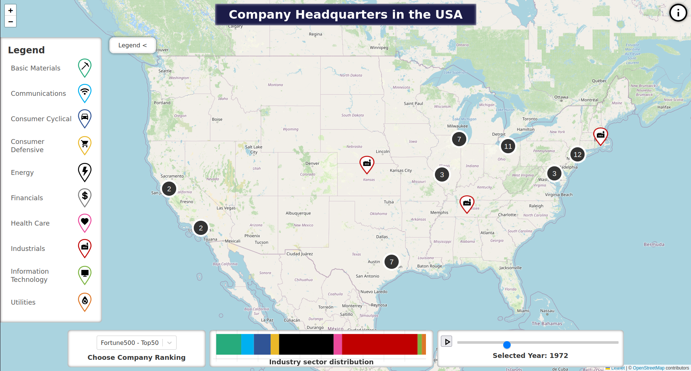

# Company Headquarters in the USA
The objective of this university project is to demonstrate how the US industry has changed over time, as represented by the major corporate headquarters included in the SP500 or Fortune 500 indices.
The geographical distribution of these headquarters and their respective industry sectors are presented on a map where users can select different years and choose between two indexes.

## Table of Contents
- [Data](#data)
- [Visualisation](#visualisation)
- [Getting Started](#getting-started)
  - [Installation](#installation)
  - [Run scraper: scrapy (Get SP500 and Fortune 500 rankings)](#run-scraper-scrapy-get-sp500-and-fortune-500-rankings)
  - [Official Wikipedia API (Try to get headquarters locations)](#official-wikipedia-api-try-to-get-headquarters-locations)
  - [Wikidata API (Get headquarters locations \& industry sectors)](#wikidata-api-get-headquarters-locations--industry-sectors)
    - [How the location data processing works](#how-the-location-data-processing-works)
    - [Problems](#problems)
    - [Solutions](#solutions)
    - [Notes](#notes)
- [Credits](#credits)

## Data
This repository is the data scraping and processing part of the project. 

- The historical company rankings (SP500 and Fortune 500) over many years are scraped from websites.
- The headquarters locations are then retrieved from the Wikidata API. 
- The data is then processed and converted into a GeoJSON format for visualization on a map.

## Visualisation
The visualization/mapping of the headquarters locations data can be found in [this repository](https://github.com/JonasGreim/leaflet-map-project).

The final visualization result can be found as website [here](https://jonasgreim.github.io/leaflet-map-project/).


## Getting Started:
To get a local copy up and running, follow these simple steps.
### Installation
1. Set up a virtual python environment (Python version >= 3.10):
```bash
python3 -m venv venv
source venv/bin/activate
```
2. Install the required packages:
```bash
- pip3 install -r requirements.tx
```

## Run scraper: scrapy (Get SP500 and Fortune 500 rankings)
**Info:** The scraper only searches the existing annual SP500 and Fortune 500 rankings of the specified websites. 
There are no headquarters locations in the rankings.

- The Fortune 500 data are extracted from the website for the years 1958-2005 (no more years available on this website).
- The SP500 data from the website are extracted for the years 1990-2024.

go into the scrapy folder:

```bash
cd companyRankingsScraper
```

Fortune500:
```bash 
scrapy crawl us-companies-fortune500 -o fortune500.json
```

SP500:
```bash
scrapy crawl us-companies-sp500 
```

## Official Wikipedia API (Try to get headquarters locations)
First we tried to preserve the headquarters locations of the companies with the official Wikipedia API.

**Problem:** 
- You get the same data as you would scrape the wikipedia page (same thing with python wikipedia api wrappers)
- The HTML structure of Wikipedia company articles is inconsistent -> cannot scrape the data (f.e. the fact table)
- We also tried the new Wikipedia Geosearch API ([link](https://www.mediawiki.org/wiki/API:Geosearch#Example_1:_Obtain_coordinates))
  - But only a few wikipedia pages have coordinates 

**run:**
```bash 
cd officialWikiApi
python3 officialWikiApi.py
```

## Wikidata API (Get headquarters locations & industry sectors)

To access the headquarters location data of the companies, we used the Wikidata API.

### How the location data processing works:

1. [1_initUniqueComaniesJson.py](wikidata/1_initUniqueComaniesJson.py):
   - Creates a unique company list from the ranking data
   - With the attributes: `companyName`, `searchQueryCompanyName`, `wikiDataName`, `qid`
   - The reason why you need these attributes is: 
     - Wikidata name search is really inaccurate (and also the scraped data)
     - With these you can manually compare your search name (companyName) with the retrieved name (wikiDataName)
     - If wrong you can change the searchQueryCompanyName manually 
     - the original scraped companyName is used to map the unique companies to the ranking data later on

2. [2_getAllQidsThroughCompanyNameList.py](wikidata/2_getAllQidsThroughCompanyNameList.py):
   - Adds the wikidata qids to the unique company list (qid = wikidata page id)
   - Looping through the unique companies and retrieve the qid with the searchQueryCompanyName through the Wikidata API
   - Search: only text search in wikidata title and synonyms
   - API response: First qid result is taken (returns array)

3. [3_getAllLocationDataThroughQIDList.py](wikidata/3_getAllLocationDataThroughQIDList.py)
  - Adds the headquarters location data to the unique company list
  - Get wikidata page data through the qid and extract the headquarters location

4. [4_getAllIndustryDataThroughQIDList.py](wikidata/4_getAllIndustryDataThroughQIDList.py)
  - Adds the industry sector data to the unique company list
  - Get wikidata page data through the qid and extract the industry sector
  - For our frontend, we categorized each company into one of ten industry sectors using ChatGPT.

5. [5_mapUniqueCompaniesToRankingFortune500.py](wikidata/5_mapUniqueCompaniesToRankingFortune500.py)
   (or [5_mapUniqueCompaniesToRankingSp500.py](wikidata/5_mapUniqueCompaniesToRankingSp500.py))
   - Maps the modified unique companies data to the ranking data

6. [6_createGeoJsonFortune500.py](wikidata/6_createGeoJsonFortune500.py)
    (or [6_createGeoJsonSp500.py](wikidata/6_createGeoJsonSp500.py))
    - Converts the json data to a GeoJSON format


### Problems:
- The API string search to find Wikidata page entries is really inaccurate
- Wikidata api docs are really confusing/messed up
- The scraped data has sometimes unusual variations of company names or abbreviations
- For some old companies there are no Wikidata entries even no Wikipedia entries
- Wikidata only provides current headquarters location data, not historical locations.

### Solutions:
- **Inaccurate search, scraped data spelling:**
  - Manually change the searchQueryCompanyName in the json
  - Tried wikidata tag filtering, but it didn't work out (Wikidata entries have incomplete tag data)
  - Final trail and error approach: 
    - Get the qid through the searchQueryCompanyName -> if no qid found -> manually change company name
    - Get location data through the qid -> if no coordinates found -> change name -> run qid search again (wrong Wikidata entry with the same name)
  
- **Historical data:**
  - Google headquarters addresses -> manually change searchQueryCompanyName

### Notes
- The Wikidata websearch is different from the API search (a little bit better)
- Tried out also [dbpedia](https://www.dbpedia.org/) -> same problems as with the wikidata api
- Tried out also to ask chatgpt to generate the data completely -> wrong headquarters coordinates

    

[//]: # (- get qid -> if no qid found &#40;5/49&#41;)
[//]: # (- -> trail and error ->  15 of 49 failed)
[//]: # (run industry sector search -> 1  of  49 failed)


[//]: # (TODO:)

[//]: # (- read me hübsch machen)
[//]: # (- vorgang notieren)
[//]: # (- anzahl von fails notieren und helper functions infos extract)
[//]: # (- check data again -> right qids and names)
[//]: # (- SP500 Berkshire Hathaway, JPMorgan Chase, Mastercard)
[//]: # (- maybe table of contents)


### Credits
- Jiacheng Lang & Jonas Greim
- The university course "Computational Spatial Humanities," taught by Dr. Thomas Efer at the University of Leipzig